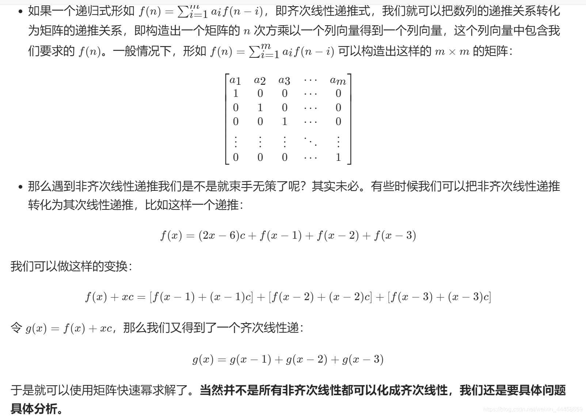
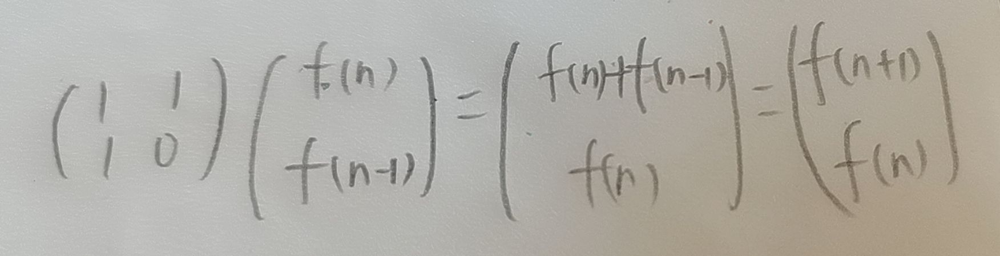

# 动态规划

## 70.爬楼梯

---

### dp+滚动数组

~~~javascript
var climbStairs = function (n) {
  if (n < 2) return 1;

  let p = 1, q = 1, r = 0;
  for (let i = 2; i <= n; i++) {
    r = p + q;
    p = q;
    q = r;
  }
  return r;
};
~~~

### dp+矩阵快速幂

设f(x)为到达楼梯x的方案数, 则有f(x)=f(x-1)+f(x-2).

易知f(2)=2, f(1)=1, 则f(0)=f(2)-f(1)=1.

根据上图可构造出M=$$  
\begin{pmatrix}  
1&1\\
1&0  
\end{pmatrix}  $$,

让M与$$ \begin{pmatrix}f(n)\\f(n-1)\end{pmatrix}  $$相乘

关键是找到一个找出一个等式$M^1 X=Y$ 使得Y中所有的项都是X中对应项的下一项,这样就可以递归的调用该公式 , 由上式得出:

$M^1 \begin{pmatrix}f(n)\\f(n-1)\end{pmatrix}= \begin{pmatrix}f(n+1)\\f(n)\end{pmatrix} $

递归调用该公式可得出:

$M^n \begin{pmatrix}f(1)\\f(0)\end{pmatrix}= \begin{pmatrix}f(n+1)\\f(n)\end{pmatrix} $

M已知,即:

$$\begin{pmatrix}  
1&1\\
1&0  
\end{pmatrix}^n \begin{pmatrix}1\\1\end{pmatrix}= \begin{pmatrix}f(n+1)\\f(n)\end{pmatrix} $$

因此只要能够算出$M^n$来, 带入等式即可算出f(n) , 可以使用矩阵快速幂的方法快速算出一个矩阵的给定幂次方,时间复杂度为$O(\log n)$

[矩阵快速幂](https://www.bilibili.com/video/BV1GA411Q79k/?spm_id_from=333.337.search-card.all.click&vd_source=61fd1d56f63fb0a5f293c8ee44c330e6)

完整实现:

~~~javascript
var climbStairs = function (n) {
  let m = [[1, 1], [1, 0]];
  let res = fastPow(m, n);   //算出m的n次方

  return res[1][0] + res[1][1]; //根据矩阵乘法,算出f(n)

};
// 二阶矩阵相乘
const multiplyMatrix = (a, b) => {
  const res = [[0, 0], [0, 0]];
  for (let i = 0; i < 2; i++)
    for (let j = 0; j < 2; j++)
      res[i][j] = a[i][0] * b[0][j] + a[i][1] * b[1][j];

  return res;
};

// 矩阵快速幂
const fastPow = (m, n) => {
  let res = [[1, 0], [0, 1]]; // 二阶单位矩阵
  while (n > 0) {
    if ((n & 1) === 1) {
      res = multiplyMatrix(res, m);
    }
    m = multiplyMatrix(m, m);
    n >>= 1;
  }
  return res;
}
~~~

## 509.斐波那契

### dp+滚动数组

~~~javascript
var fib = function(n) {
    if (n < 2) {
        return n;
    }
    let p = 0, q = 0, r = 1;
    for (let i = 2; i <= n; i++) {
        p = q;
        q = r;
        r = p + q;
    }
    return r;
};
~~~

### dp+矩阵快速幂

同[爬楼梯](#dp+矩阵快速幂)

不过因为斐波那契的$f(0)=0$​, 最后会出现这样的情况:

$$\begin{pmatrix}  
1&1\\
1&0  
\end{pmatrix}^n \begin{pmatrix}1\\0\end{pmatrix}= \begin{pmatrix}f(n+1)\\f(n)\end{pmatrix} $$

此时无法求得f(n), 我们用快速幂算到$M^{n-1}$, 此时n=n-1, f(n+1)=f(n-1+1)=f(n), 或是改变等式:

$$\begin{pmatrix}  
1&1\\
1&0  
\end{pmatrix}^{n+1} \begin{pmatrix}f(2)\\f(1)\end{pmatrix}= \begin{pmatrix}f(n+1)\\f(n)\end{pmatrix} $$

这里我们选用第一种方式:

~~~javascript
var fib = function(n) {
    if(n<2) return n;
    let m = [[1, 1], [1, 0]];
    let res = fastPow(m, n-1);// 只需改变这里
    return res[0][0];		  // 和这里
};
~~~

## 1137.泰波那契

### dp+滚动数组

~~~javascript
var tribonacci = function (n) {
    if(n===0) return 0;
    else if(n<3) return 1;
    else{
        let j=0,k=l=1,r=0;
        for(let i=3;i<=n;i++){
            r=j+k+l;
            [j,k,l]=[k,l,r];
        }
        return r;
    }
};
~~~

### dp+矩阵快速幂

~~~javascript
var tribonacci = function (n) {
  if (n === 0) return 0;
  else if (n < 3) return 1;
  else {
    let M = [[1, 1, 1], [1, 0, 0], [0, 1, 0]];
    let res = fastPow(M, n);
    return res[2][0] + res[2][1];
  }
};

const fastPow = (M, n) => {
  let res = [[1, 0, 0], [0, 1, 0], [0, 0, 1]];

  while (n > 0) {
    if ((n & 1) === 1) {
      res = muitiply(M, res);
    }
    M = muitiply(M, M);
    n >>= 1;
  }
  return res;
}

const muitiply = (a, b) => {
  let res = [[0, 0, 0], [0, 0, 0], [0, 0, 0]];
  for (let i = 0; i < 3; i++)
    for (let j = 0; j < 3; j++)
      res[i][j] = a[i][0] * b[0][j] + a[i][1] * b[1][j] + a[i][2] * b[2][j];
  return res;
}
~~~

## 746.最小花费爬楼梯

