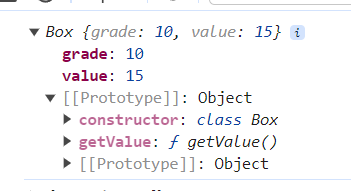
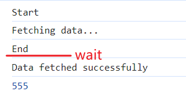

# JavaScript基础


## 声明变量


### var

`var`声明变量时可以不初始化，其默认值为`undifined`

在函数外使用`var`声明的变量是全局作用域

```javascript
var carName = "Volvo";
 
// 这里可以使用 carName 变量
 
function myFunction() {
    // 这里也可以使用 carName 变量
}
```

函数内`var`声明的变量是函数作用域

~~~javascript
// 这里不能使用 carName 变量
 
function myFunction() {
    var carName = "Volvo";
    // 这里可以使用 carName 变量
}
 
// 这里不能使用 carName 变量
~~~

`var`声明的变量可重复声明,后声明的覆盖之前的（var不支持块级作用域）

~~~javascript
var x = 10;
// 这里输出 x 为 10
{ 
    var x = 2;
    // 这里输出 x 为 2
}
// 这里输出 x 为 2
~~~


### let

[JS let](https://www.w3school.com.cn/js/js_let.asp)

`let`声明的变量为块级作用域，即只在声明所在的`{}`内可访问，不支持变量提升，即声明前不可访问

~~~javascript
{ 
    let x = 2;
}
// 这里不能使用 x 变量
~~~

`let`声明的变量不可重复声明


`let`声明变量不会被提升

~~~javascript
// 在此处，您不可以使用 carName
let carName;
~~~


### const

[JS const](https://www.w3school.com.cn/js/js_const.asp)

`const`声明变量为块级作用域，const声明时必须初始化。

`const` 声明变量不可重新赋值

~~~javascript
const PI = 3.141592653589793;
PI = 3.14;      // 会出错
PI = PI + 10;   // 也会出错
~~~

不可变的是引用的地址

~~~javascript
// 您可以创建 const 对象：
const car = {type:"porsche", model:"911", color:"Black"};

// 您可以更改属性：
car.color = "White";

// 您可以添加属性：
car.owner = "Bill";
~~~


### 声明提升

[js变量提升](https://juejin.cn/post/7309040676652744755?from=search-suggest)

[js变量提升(举例)](https://juejin.cn/post/6933377315573497864)


## 整数计算精度丢失问题


## Js解构赋值

[解构赋值 MDN](https://developer.mozilla.org/zh-CN/docs/Web/JavaScript/Reference/Operators/Destructuring_assignment)

[6分钟学会25个解构赋值的方法技巧](https://www.bilibili.com/video/BV1wY411T7oJ/?share_source=copy_web&vd_source=b23f8a9cd162ff7a94424d5480360ac9)

[JavaScript解构的原理是什么](https://www.bilibili.com/video/BV1dz4y1G7hn/?share_source=copy_web&vd_source=b23f8a9cd162ff7a94424d5480360ac9)


**解构赋值**语法是一种 Javascript 表达式。可以将数组中的值或对象的属性取出，赋值给其他变量。


### 数组解构


> 解构数组并重命名

~~~javascript
const arr=['apple','banana','orange','melon'];

let [a,b,c,d]=arr;	//相当于使用let定义了四个变量a b c d
console.log(a,b,c,d);  //输出 apple banana orange melon
console.log(b,d,a,c);	//banana melon apple orange
~~~

> 压缩解构

~~~javascript
let a, b, rest;
[a, b] = [10, 20];

console.log(a);
// expected output: 10

console.log(b);
// expected output: 20

[a, b, ...rest] = [10, 20, 30, 40, 50];

console.log(rest);
// expected output: Array [30,40,50]

~~~

> 使用逗号跳过数组中的元素

```javascript
let [greeting,,,name] = ["Hello", "I" , "am", "Sarah"];

console.log(greeting);//"Hello"
console.log(name);//"Sarah"
```

> 可以为变量分配默认值，以防止从数组中提取的值是 `undefined`：
>
> ==只在undifined的情况下会使用默认值，null不会==

```javascript
let [greeting = "hi",name = "Sarah"] = ["hello"];

console.log(greeting);//"Hello"
console.log(name);//"Sarah"
```

`name` 的值就是 “Sarah”，因为它在数组中未定义。


### 对象解构

[参考](https://www.freecodecamp.org/chinese/news/array-and-object-destructuring-in-javascript/)

#### 基本的对象解构

```javascript
let {name, country, job} = {name: "Sarah", country: "Nigeria", job: "Developer"};

console.log(name);//"Sarah"
console.log(country);//"Nigeria"
console.log(job);//Developer"
```


~~~javascript
({ a, b } = { a: 10, b: 20 });
console.log(a); // 10
console.log(b); // 20

({a, b, ...rest} = {a: 10, b: 20, c: 30, d: 40});
console.log(a); // 10
console.log(b); // 20
console.log(rest); // {c: 30, d: 40}
~~~


#### 分配之前声明的变量

对象中的变量可以在使用解构分配之前声明。让我们尝试一下：

```javascript
let person = {name: "Sarah", country: "Nigeria", job: "Developer"}; 
let name, country, job;

{name, country, job} = person;

console.log(name);// Error : "Unexpected token ="
```

等等，发生了什么事？哦，我们忘了在大括号前加上`()`。

使用不带声明的对象文字解构赋值时，在赋值语句外面加上 `( )` 是必需的语法。这是因为左侧的 `{}` 被认为是一个块，而不是对象文字。因此，这是正确执行此操作的方法：

```javascript
let person = {name: "Sarah", country: "Nigeria", job: "Developer"};
let name, country, job;

({name, country, job} = person);

console.log(name);//"Sarah"
console.log(job);//"Developer"
```

在使用这个语法时还需要注意，`()` 之后应使用分号。否则，它可能被用来执行上一行的代码。

请注意，对象左侧的变量应与对象 `person` 中的属性键具有相同的名称。如果名称不同，将显示 `undefined`


#### 解构并重命名

如果要将对象的值分配给新变量，而不是使用属性名称，则可以执行以下操作：

```javascript
let person = {name: "Sarah", country: "Nigeria", job: "Developer"};

let {name: foo, job: bar} = person;

console.log(foo);//"Sarah"
console.log(bar);//"Developer"
```

提取的值被传递给新的变量 `foo` 和 `bar`。


#### 使用默认值

对象解构中也可以使用默认值，以防止要从对象中提取数据时，变量是 `undefined`：

```javascript
let person = {name: "Sarah", country: "Nigeria", job: "Developer"};

let {name = "myName", friend = "Annie"} = person;

console.log(name);//"Sarah"
console.log(friend);//"Annie"
```

因此，如果该值不是未定义的，则该变量将存储从对象中提取的值（例如 `name`）。否则，它将使用默认值，就像 `friend` 一样。

当我们将值分配给新变量时，还可以设置默认值：

```javascript
let person = {name: "Sarah", country: "Nigeria", job: "Developer"};

let {name:foo = "myName", friend: bar = "Annie"} = person;

console.log(foo);//"Sarah"
console.log(bar);//"Annie"
```

以上代码是从 `person` 中提取了 `name`，并将其分配给了另一个变量。`friend` 在 `person` 中是 `undefined`，因此新变量 `bar` 被赋予默认值。


#### 计算属性名

计算属性名称是另一个对象特性，也可用于解构。如果将属性放在方括号中，则可以通过表达式指定属性的名称：

```javascript
let prop = "name";

let {[prop] : foo} = {name: "Sarah", country: "Nigeria", job: "Developer"};

console.log(foo);//"Sarah"
```


## 生成器函数


## 迭代器


## 构造函数与类

使用构造函数和class关键字都能创建类, class是ES6新增的特性.

`__proto__`和`[[Prototype]]`是一个东西

==对象的`__proto__`属性指向其构造函数的prototype==, 使用`__proto__`可串起原型链

==函数的`prototype`属性指向其原型对象==

[原型对象和原型链](https://www.bilibili.com/video/BV1ci4y157Ci/?p=3&share_source=copy_web&vd_source=b23f8a9cd162ff7a94424d5480360ac9)看p4

### 构造函数

在 JavaScript 中，所有的函数都有一个名为 `prototype` 的属性。当你调用一个函数作为构造函数时，这个属性被设置为新构造对象的原型（按照惯例，在名为 `__proto__` 的属性中）。

通过构造函数创建的每一个实例都会自动将构造函数的 [`prototype`](https://developer.mozilla.org/zh-CN/docs/Web/JavaScript/Reference/Global_Objects/Function/prototype) 属性作为其 `[[Prototype]]`。即，`Object.getPrototypeOf(new Box()) === Box.prototype`。

```javascript
// 一个构造函数
function Box(value) {
  this.value = value;
}

// 使用 Box() 构造函数创建的所有盒子都将具有的属性
Box.prototype.getValue = function () {
  return this.value;
};

const boxes = [new Box(1), new Box(2), new Box(3)];
console.dir(boxes[0].constructor); //[Function: Box]
```

`Constructor.prototype` 默认具有一个自有属性：[`constructor`](https://developer.mozilla.org/zh-CN/docs/Web/JavaScript/Reference/Global_Objects/Object/constructor)，它引用了构造函数本身。即，`Box.prototype.constructor === Box`。这允许我们在任何实例中使用`constructor`访问其构造函数。

~~~javascript
function Person(name) {
  this.name = name;
}
console.dir(Person)
console.dir(Person.prototype)	//Persona的原型
console.dir(Person.prototype.__proto__)		//Object.proyotype
console.dir(Person.prototype.__proto__.__proto__)		//null
~~~

> Persona的原型链:
>
> Persona.prototype ==> Object.prototype ==> null

有个对象叫 `Object.prototype`，它是最基础的原型，所有对象默认都拥有它。`Object.prototype` 的原型是 `null`，所以它位于原型链的终点

### 类

上面的构造函数可以重写为[类](https://developer.mozilla.org/zh-CN/docs/Web/JavaScript/Reference/Classes)：

```javascript
class Box {
  constructor(value) {
    this.value = value;
  }

  // 在 Box.prototype 上创建方法
  getValue() {
    return this.value;
  }
}

const box1 = new Box(15)
console.log(box1)
console.log(Object.getPrototypeOf(box1))
```



使用this声明的变量和方法都是属于实例的

~~~javascript
class MyClass {
    something   //实例的   
  constructor(name, age) {
    this.name = name;   //实例的
    this.age = age;		//实例的
    this.sayHello = () => {    //实例的
      console.log("Hello");
    }
  }
  sayHi = () => { console.log('Hi') }   //实例的,因为这实际上是把一个匿名函数赋给了名叫sayHi的属性
  sayGoodbye() {   	//属于Prototype
    console.log("Goodbye")
  }
}
~~~


> 可以使用下面的语句使当前类不能被实例化

~~~javascript
class Box {
  constructor(value) {
    if (new.target === Box)  //写在`constructor`或构造函数中
      throw ("invalid!")     //
    this.value = value;
  }
}
~~~


## 继承和原型

[继承和原型链](https://developer.mozilla.org/zh-CN/docs/Web/JavaScript/Inheritance_and_the_prototype_chain)

[使用不同方法的继承](https://developer.mozilla.org/zh-CN/docs/Web/JavaScript/Inheritance_and_the_prototype_chain#%E4%BD%BF%E7%94%A8%E4%B8%8D%E5%90%8C%E7%9A%84%E6%96%B9%E6%B3%95%E6%9D%A5%E5%88%9B%E5%BB%BA%E5%AF%B9%E8%B1%A1%E5%92%8C%E6%94%B9%E5%8F%98%E5%8E%9F%E5%9E%8B%E9%93%BE)


## getter setter


## 事件循环

[JavaScript 如何工作的: 事件循环和异步编程的崛起 + 5 个关于如何使用 async/await 编写更好的技巧](https://juejin.cn/post/6844903518319411207)


### 宏任务和微任务

异步任务可分为两类:

- 宏任务:promise.then   async/await  读取文件  新程序执行等
- 微任务:setTimeout  setTimeeval  ajax   DOM事件等


### 事件循环内部结构

- 调用栈 (后进先出)

- 任务队列 (先进先出)

  - 宏任务队列
  - 微任务队列

  

### 事件循环执行优先级

1. 同步语句
2. process.nextTick
3. 微任务
4. 浏览器渲染
5. 宏任务
6. setImmediate


事件循环机制:

从上到下执行程序,执行语句时会将该语句放到调用栈中,执行优先级高的语句, 遇到低优先级的语句放到任务队列中, 当调用栈为空时, 去扫描任务队列, 将当前最高优先级的语句按队列顺序执行,当调用栈为空时,再次重复上面的过程直到没有语句可执行.


### 示例

~~~javascript
// 模拟一个异步函数，返回一个 Promise 对象
function fetchData() {
  return new Promise(resolve => {
    setTimeout(() => {
      resolve('Data fetched successfully');
    }, 2000); // 模拟异步操作，2秒后解析 Promise
  });
}

// 异步函数，使用 await 等待 fetchData 函数的结果
async function getData() {
  console.log('Fetching data...');
  const result = await fetchData(); // 使用 await 等待 fetchData 函数的结果
  console.log(result); // 当 Promise 解析后，继续执行后续代码
  console.log(555)
}

console.log('Start');
getData();
console.log('End');
~~~




### 讲解

[前端面试题：JavaScript运行机制（三）宏任务微任务](https://www.bilibili.com/video/BV1Av411n77n/?share_source=copy_web&vd_source=b23f8a9cd162ff7a94424d5480360ac9)

[JavaScript 宏任务与微任务 - Web前端工程师面试题讲解](https://www.bilibili.com/video/BV1eQ4y1d7mE/?share_source=copy_web&vd_source=b23f8a9cd162ff7a94424d5480360ac9)

[javascript预解析、原型链、微任务宏任务](https://www.bilibili.com/video/BV1MR4y1A7ws/?p=6&share_source=copy_web&vd_source=b23f8a9cd162ff7a94424d5480360ac9)


## Promise

[see here](./Promise.md)


# ES6

[ES6教程](https://wangdoc.com/es6/)


## Class


ES6 的类，完全可以看作构造函数的另一种写法。

```javascript
class Point {
  // ...
}

typeof Point // "function"
Point === Point.prototype.constructor // true
```

上面代码表明，类的数据类型就是函数，类本身就指向构造函数。


构造函数的`prototype`属性，在 ES6 的“类”上面继续存在。事实上，类的所有方法都定义在类的`prototype`属性上面。

```javascript
class Point {
  constructor() {
    // ...
  }

  toString() {
    // ...
  }

  toValue() {
    // ...
  }
}

// 等同于

Point.prototype = {
  constructor() {},
  toString() {},
  toValue() {},
};
```

上面代码中，`constructor()`、`toString()`、`toValue()`这三个方法，其实都是定义在`Point.prototype`上面。

因此，在类的实例上面调用方法，其实就是调用原型上的方法。

```
class B {}
const b = new B();

b.constructor === B.prototype.constructor // true
```


### 类的实例


与 ES5 一样，类的所有实例共享一个原型对象。

```
var p1 = new Point(2,3);
var p2 = new Point(3,2);

p1.__proto__ === p2.__proto__
//true
```


### 实例属性


[ES2022](https://github.com/tc39/proposal-class-fields) 为类的实例属性，又规定了一种新写法。实例属性现在除了可以定义在`constructor()`方法里面的`this`上面，也可以定义在类内部的最顶层。

```javascript
// 原来的写法
class IncreasingCounter {
  constructor() {
    this._count = 0;
  }
  get value() {
    console.log('Getting the current value!');
    return this._count;
  }
  increment() {
    this._count++;
  }
}
```

上面示例中，实例属性`_count`定义在`constructor()`方法里面的`this`上面。

现在的新写法是，这个属性也可以定义在类的最顶层，其他都不变。

```js
class IncreasingCounter {
  _count = 0;
  get value() {
    console.log('Getting the current value!');
    return this._count;
  }
  increment() {
    this._count++;
  }
}
```

上面代码中，实例属性`_count`与取值函数`value()`和`increment()`方法，处于同一个层级。这时，不需要在实例属性前面加上`this`。

注意，新写法定义的属性是实例对象自身的属性，而不是定义在实例对象的原型上面。

这种新写法的好处是，所有实例对象自身的属性都定义在类的头部，看上去比较整齐，一眼就能看出这个类有哪些实例属性。

```js
class foo {
  bar = 'hello';
  baz = 'world';

  constructor() {
    // ...
  }
}
```

上面的代码，一眼就能看出，`foo`类有两个实例属性，一目了然。另外，写起来也比较简洁。


### ES6继承的原理

[寄生组合继承](https://www.bilibili.com/video/BV1mH4y1Q7Z7/?p=11&share_source=copy_web&vd_source=b23f8a9cd162ff7a94424d5480360ac9)

[类的 prototype 属性和\__proto__属性](https://wangdoc.com/es6/class-extends#%E7%B1%BB%E7%9A%84-prototype-%E5%B1%9E%E6%80%A7%E5%92%8C__proto__%E5%B1%9E%E6%80%A7)


> extends的ES5实现

1. 使用`Object.call`函数将要构建的子类实例的this传给父类构造函数, 借父类构造函数构造子类实例, 使得子类实例拥有父类的==实例属性==
2. 将子类的`__proto__`设置为父类本身,这使得子类可以通过原型链访问父类==静态属性==
3. 使用`Object.create`函数创建一个新对象, 该对象的`__proto__`属性设置为父类构造函数的`prototype` ,然后将`__proto__`属性里的`constructor`设置为子类构造函数. 然后将构建好的对象作为子类构造函数的`prototype` , 这使得子类实例可以通过原型链访问父类==原型方法==

以上行为使得下面的语句成立:

~~~js
class A {
}

class B extends A {
}

B.__proto__ === A // true
B.prototype.__proto__ === A.prototype // true
~~~


# Node.js


# V8引擎

