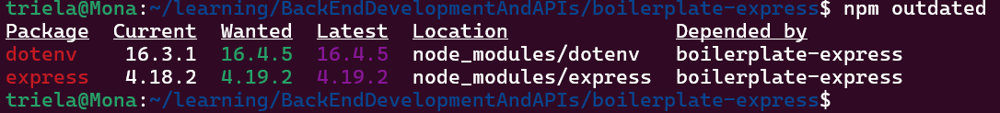
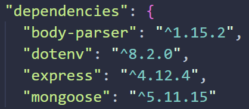

# Node.js全局变量

常见全局变量:

[文档](https://nodejs.cn/api/globals.html#%E5%85%A8%E5%B1%80%E5%AF%B9%E8%B1%A1)

- \__filename:返回所执行脚本文件的绝对路径
- \__dirname:返回所执行脚本文件所在目录
- process:提供与当前进程互动的接口


# process


方法:

- [memoryUsage()](https://nodejs.cn/api/process.html#processmemoryusage):返回描述 Node.js 进程的内存使用量（以字节为单位）的对象
- cwd(): 返回执行node进程的目录
- uptime(): 返回当前Node.js已经运行的秒数


属性:

- [env](https://nodejs.cn/api/process.html#processenv): The `process.env` property returns an object containing the user environment. See [`environ(7)`](http://man7.org/linux/man-pages/man7/environ.7.html).可从该对象里找需要的信息
- [arch](https://nodejs.cn/api/process.html#processarch): 返回操作系统的CPU架构
- [version](https://nodejs.cn/api/process.html#processversion): 返回node版本
- platform: 返回node所在的操作系统平台的标识
- [argv](https://nodejs.cn/api/process.html#processargv): 返回数组，其中包含启动 Node.js 进程时传入的命令行参数。
- pid: 返回当前进程id


# path


## [basename](https://nodejs.cn/api/path.html#pathbasenamepath-suffix)获取文件名

path.basename(path [,suffix])

- `path`  <string>
- `suffix` <string> 要删除的可选后缀
- 返回：<string>


`path.basename()` 方法返回 `path` 的最后一部分，类似于 Unix `basename` 命令。忽略尾随 [目录分隔符](https://nodejs.cn/api/path.html#pathsep)。

~~~javascript
path.basename('/foo/bar/baz/asdf/quux.html');
// Returns: 'quux.html'

path.basename('/foo/bar/baz/asdf/quux.html', '.html');
// Returns: 'quux'
~~~


## [dirname](https://nodejs.cn/api/path.html#pathdirnamepath)获取目录名


~~~javascript
path.dirname('/foo/bar/baz/asdf/quux');
// Returns: '/foo/bar/baz/asdf'
~~~

要获取当前目录名称,使用`__dirname`变量.


## [extname]()获取扩展名

`path.extname()` 方法返回 `path` 的扩展名，即 `path` 的最后一部分中从最后一次出现的 `.`（句点）字符到字符串的结尾。如果 `path` 的最后一部分中没有 `.`，或者除了 `path` 的基本名称（参见 `path.basename()`）的第一个字符之外没有 `.` 个字符，则返回空字符串。


~~~javascript
path.extname('index.html');
// Returns: '.html'

path.extname('index.coffee.md');
// Returns: '.md'

path.extname('index.');
// Returns: '.'

path.extname('index');
// Returns: ''

path.extname('.index');
// Returns: ''

path.extname('.index.md');
// Returns: '.md'
~~~


## [parse](https://nodejs.cn/api/path.html#pathparsepath)解析路径


## [format](https://nodejs.cn/api/path.html#pathformatpathobject)从对象返回路径


## [join](https://nodejs.cn/api/path.html#pathjoinpaths)拼接路径


## [resolve](https://nodejs.cn/api/path.html#pathresolvepaths)得到绝对路径


# Buffer


## 创建Buffer

---

~~~javascript
import { Buffer } from 'node:buffer';

// Creates a zero-filled Buffer of length 10.
const buf1 = Buffer.alloc(10);

// Creates a Buffer of length 10,
// filled with bytes which all have the value `1`.
const buf2 = Buffer.alloc(10, 1);

// Creates an uninitialized buffer of length 10.
// This is faster than calling Buffer.alloc() but the returned
// Buffer instance might contain old data that needs to be
// overwritten using fill(), write(), or other functions that fill the Buffer's
// contents.
const buf3 = Buffer.allocUnsafe(10);

// Creates a Buffer containing the bytes [1, 2, 3].
const buf4 = Buffer.from([1, 2, 3]);

// Creates a Buffer containing the bytes [1, 1, 1, 1] – the entries
// are all truncated using `(value & 255)` to fit into the range 0–255.
const buf5 = Buffer.from([257, 257.5, -255, '1']);

// Creates a Buffer containing the UTF-8-encoded bytes for the string 'tést':
// [0x74, 0xc3, 0xa9, 0x73, 0x74] (in hexadecimal notation)
// [116, 195, 169, 115, 116] (in decimal notation)
const buf6 = Buffer.from('tést');

// Creates a Buffer containing the Latin-1 bytes [0x74, 0xe9, 0x73, 0x74].
const buf7 = Buffer.from('tést', 'latin1');
~~~


## [Buffer和字符编码](https://nodejs.cn/api/buffer.html#%E7%BC%93%E5%86%B2%E5%8C%BA%E5%92%8C%E5%AD%97%E7%AC%A6%E7%BC%96%E7%A0%81)

---

buffer和字符串转化时默认使用utf-8编码


# fs文件系统


## [readFile](https://nodejs.cn/api/fs.html#fsreadfilepath-options-callback)

---

 `fs.readFile(path[, options], callback)`

从文件中读取数据, 可在第二个参数指定编码输出文本数据

## [writeFile](https://nodejs.cn/api/fs.html#fswritefilefile-data-options-callback)

---


## [appendFile](https://nodejs.cn/api/fs.html#fswritefilefile-data-options-callback)

---


## [copyFile](https://nodejs.cn/api/fs.html#fscopyfilesrc-dest-mode-callback)

---


## [stat](https://nodejs.cn/api/fs.html#fsstatpath-options-callback)

---


## 监视文件

---

[watch](https://nodejs.cn/api/fs.html#fswatchfilename-options-listener)

[watchFile](https://nodejs.cn/api/fs.html#fswatchfilefilename-options-listener)

[unwatchFile](https://nodejs.cn/api/fs.html#fsunwatchfilefilename-listener)


# 模块化

[ESM和CommonJS](https://segmentfault.com/a/1190000041396029)

[差异](https://es6.ruanyifeng.com/#docs/module-loader#ES6-%E6%A8%A1%E5%9D%97%E4%B8%8E-CommonJS-%E6%A8%A1%E5%9D%97%E7%9A%84%E5%B7%AE%E5%BC%82)


## CommonJS

---

模块加载发生在运行时, 同步进行, 不适用于浏览器等需要网络请求的场景.

CommonJS使用module.exports导出一个对象,对象内部是要导出的函数或类, 使用require来接收导出的对象.


## ESM

---

ES6的模块是官方标准, 异步加载,编译时静态加载.

模块功能主要由两个命令构成：`export`和`import`。`export`命令用于规定模块的对外接口，`import`命令用于输入其他模块提供的功能。

### [export](https://es6.ruanyifeng.com/#docs/module#export-%E5%91%BD%E4%BB%A4)

---

目前，export 命令能够对外输出的就是三种接口：函数（Functions）， 类（Classes），var、let、const 声明的变量（Variables）。

另外，`export`语句输出的接口，与其对应的值是动态绑定关系，即通过该接口，可以取到模块内部实时的值。

```javascript
export var foo = 'bar';
setTimeout(() => foo = 'baz', 500);
```

上面代码输出变量`foo`，值为`bar`，500 毫秒之后变成`baz`。


### [import](https://es6.ruanyifeng.com/#docs/module#import-%E5%91%BD%E4%BB%A4)

---

使用`export`命令定义了模块的对外接口以后，其他 JS 文件就可以通过`import`命令加载这个模块。

```javascript
// main.js
import { firstName, lastName, year } from './profile.js';

function setName(element) {
  element.textContent = firstName + ' ' + lastName;
}
```

上面代码的`import`命令，用于加载`profile.js`文件，并从中输入变量。`import`命令接受一对大括号，里面指定要从其他模块导入的变量名。大括号里面的变量名，必须与被导入模块（`profile.js`）对外接口的名称相同。

如果想为输入的变量重新取一个名字，`import`命令要使用`as`关键字，将输入的变量重命名。

```javascript
import { lastName as surname } from './profile.js';
```

==import会执行所加载的模块==


### [export default](https://es6.ruanyifeng.com/#docs/module#export-default-%E5%91%BD%E4%BB%A4)

---


### [import()](https://es6.ruanyifeng.com/#docs/module#import)

---

这个是一个函数,可以动态加载模块, 和import命令不是一个东西.


# npm

[npm文档](https://npm.nodejs.cn/)


## install

### 安装所有依赖

---

如果一个项目有一个 `package.json` 文件，通过运行

```bash
npm install
```

它将在 `node_modules` 文件夹中安装项目所需的所有内容，如果它不存在则创建它。

### 安装单个包

---

你还可以安装特定的包，通过运行

```bash
npm install <package-name>

npm install <package-name>@<version>  " 安装指定版本
```

从 npm 5 开始，此命令会自动将 安装的包 添加到 `package.json` 文件依赖中。 在版本 5 之前，你需要添加标志 `--save`。

### 其他参数

---

- `--save-dev` 安装并添加条目到 `package.json` 文件开发依赖
- `--no-save` 安装但不添加条目到 `package.json` 文件依赖
- `--save-optional` 安装并添加条目到 `package.json` 文件可选依赖
- `--no-optional` 将阻止安装可选依赖

也可以使用标志的简写形式：

- -S：`--save`
- -D：`--save-dev`
- -O：`--save-optional`

开发依赖是一些开发时需要的库,比如测试库 打包库等, 这些依赖不应该在release版本出现.

常规依赖是项目运行必须的库,比如express等


### 全局安装

---

普通安装的依赖只在当前项目有效, 使用

~~~bash
npm install <package-name> --global
~~~

全局下载依赖


## 依赖版本控制

---

使用`npm outdated`命令查看依赖的版本情况




使用`npm uninstall <pname>`来卸载特定依赖

使用 `npm update`来更新依赖版本



依赖版本号前的字符可控制更新的行为:

- `^`表示只更新patch版本
- `~`表示更新patch和minor版本
- `*`表示更新所有版本(不推荐使用)


## placeholder


