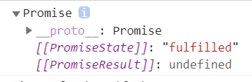

# Promise

视频: https://www.bilibili.com/video/BV1454y1R7vj?p=10

[MDN Promise](https://developer.mozilla.org/zh-CN/docs/Web/JavaScript/Reference/Global_Objects/Promise)

[源文档](https://www.yuque.com/wanfeng-uqsak/alyy23/ri5217)

## 构造函数

 语法

~~~javascript
new Promise(( resolve, reject ) =>{})
~~~

- Promise接受一个函数`executeor`作为参数，==`executer`函数在构造Promise的时候立即执行,是同步的==

- `executor`中有两个参数函数

	- resolve
	- reject
	

## Promise的状态

[原始Promise提案](https://github.com/domenic/promises-unwrapping/blob/master/docs/states-and-fates.md)

- **settled**: 包括(resolved、jejected)，处于该状态的Promise已经被敲定
- **lock-in**: 如果调用resolve的时候传入的参数为`thenable`对象, 比如另一个Promise, 则本Promise立即被锁定, 等到内部的Promise处于`settled`状态时才会被解决

[示例](https://developer.mozilla.org/zh-CN/docs/Web/JavaScript/Reference/Global_Objects/Promise/Promise#%E7%A4%BA%E4%BE%8B)

●resolve():使当前Promise对象的状态改成fulFilled

●reject(): 使当前Promise对象状态改成rejected

> Promise状态的改变是一次性的, 只有第一次调用 `resolveFunc` 或 `rejectFunc` 会影响 Promise 的最终状态，随后对任一函数的调用都不能更改兑现值或拒绝原因，也不能将其最终状态从“已兑现”转换为“已拒绝”或相反。

示例1

~~~javascript
const p = new Promise((resolve, reject) => {
	// resolve(): 调用函数, 使当前Promise对象的状态改成fulfilled
  resolve();
})
console.dir(p) // fulfilled
~~~

## then

[文档](https://developer.mozilla.org/zh-CN/docs/Web/JavaScript/Reference/Global_Objects/Promise/then)

Definition from MDN:

> [`Promise`](https://developer.mozilla.org/zh-CN/docs/Web/JavaScript/Reference/Global_Objects/Promise) 实例的 **`then()`** 方法最多接受两个参数：用于 `Promise` 兑现和拒绝情况的回调函数。它立即返回一个等效的 [`Promise`](https://developer.mozilla.org/zh-CN/docs/Web/JavaScript/Reference/Global_Objects/Promise) 对象，允许你链接到其他 Promise 方法，从而实现[链式调用](https://developer.mozilla.org/zh-CN/docs/Web/JavaScript/Guide/Using_promises#链式调用)。

[参数](https://developer.mozilla.org/zh-CN/docs/Web/JavaScript/Reference/Global_Objects/Promise/then#%E5%8F%82%E6%95%B0)

[返回值](https://developer.mozilla.org/zh-CN/docs/Web/JavaScript/Reference/Global_Objects/Promise/then#%E8%BF%94%E5%9B%9E%E5%80%BC)也是一个Promise

> 示例

~~~javascript
const p = new Promise((resolve, reject) => {
  // 通过调用 resolve,传递参数,改变 当前Promise对象的结果
  // resolve("成功的结果");
  reject("失败的结果")
})

// .then方法函数
// 参数
// 两个参数都是函数
// 返回值: 是一个Promise对象
p.then(()=>{
  // 当Promise的状态使fulfilled时执行
  console.log("成功的回调")
},()=>{
  // 当Promise的状态时rejected时, 执行
  console.log("失败时调用")
})
console.dir(p) 
~~~

●在then方法的参数函数中,通过形参使用Promise对象的结果

then方法返回一个新的Promise实例,状态时pending

Promise的状态不改变,不会执行then里的方法

在then方法中,通过return将返回的Promise实例改为fulfilled状态

在then方法中,出现代码错误,将返回的Promise实例改为rejected状态 

 2) catch方法 

示例

 4.优化代码 

示例

 5.async和await 

视频链接:https://www.bilibili.com/video/BV1GA411x7z1?p=46&spm_id_from=pageDriver

视频作者:尚硅谷-李强(B站)

 1)  async 函数 

1 函数的返回值为 promise 对象

2promise 对象的结果由 async 函数执行的返回值决定

示例

JavaScript

Copy

1

2

3

4

5

6

7

8

9

10

11

12

13

async function main(){

  // 1.如果返回值是一个非Promise类型的数据

  //  return 一个字符串 数字 布尔值等都是成功的Promise对象

  // 2. 如果返回的时一个Promise对象

  //  return new Promise((resolve, reject) => {

  //  resolve("OK") 返回的是成功Promise对象,状态值:[[PromiseState]]:"fulfilled"

  //  reject("Err") 返回的是失败Promise对象,状态值:[[PromiseState]]:"rejected"		

  // 3. 抛出异常

  throw "oh No" // 状态值:[[PromiseState]]:"rejected",结果是抛出的值

})

}

let result = main();

console.log(result);

返回值是一个Promise对象

Promisefutfilted:undefined

proto:Promise

[[Promisestatejj:"fulfilled"

[[PromiseResultjj:undefined

 2)  await 表达式 

1. await 右侧的表达式一般为 promise 对象, 但也可以是其它的值

2. 如果表达式是 promise 对象, await 返回的是 promise 成功的值

3. 如果表达式是其它值, 直接将此值作为 await 的返回值

注意

1. await 必须写在 async 函数中, 但 async 函数中可以没有 await

2. 如果 await 的 promise 失败了, 就会抛出异常, 需要通过 try...catch 捕获处理

 3) async和await结合 

示例

JavaScript

Copy

1

2

3

4

5

6

7

8

9

10

11

12

13

14

15

const fs = require("fs");

const util = require("util");

const mineReadFile = util.promisify(fs.readFile);// promisify转换为Promise形态的函数

async function main(){

  // 捕获处理

​	try{

  	// 读取第一个文件的内容

​    let data1 = await mineReadFile("./resource/1.html");

​    let data2 = await mineReadFile("./resource/2.html");

​    let data3 = await mineReadFile("./resource/3.html");

  }catch(e){

  	console.log(e):	

  }

}