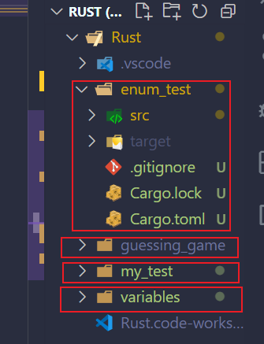

# 数据类型


## Scalar标量

---

**标量**（*scalar*）类型代表一个单独的值。Rust 有四种基本的标量类型：整型、浮点型、布尔类型和字符类型。


### 整型

---

>  Rust 中的整型

| 长度    | 有符号  | 无符号  |
| ------- | ------- | ------- |
| 8-bit   | `i8`    | `u8`    |
| 16-bit  | `i16`   | `u16`   |
| 32-bit  | `i32`   | `u32`   |
| 64-bit  | `i64`   | `u64`   |
| 128-bit | `i128`  | `u128`  |
| arch    | `isize` | `usize` |

==整形型默认i32==

`isize` 和 `usize` 类型依赖运行程序的计算机架构：64 位架构上它们是 64 位的，32 位架构上它们是 32 位的。

可以使用表格 3-2 中的任何一种形式编写数字字面值。请注意可以是多种数字类型的数字字面值允许使用类型后缀，例如 `57u8` 来指定类型，同时也允许使用 `_` 做为分隔符以方便读数，例如`1_000`，它的值与你指定的 `1000` 相同。


> Rust 中的整型字面值

|          数字字面值           | 例子          |
| :---------------------------: | ------------- |
|       Decimal (十进制)        | `98_222`      |
|     Hex (十六进制)  (0x)      | `0xff`        |
|     Octal (八进制)  (0o)      | `0o77`        |
|     Binary (二进制)  (0b)     | `0b1111_0000` |
| Byte (单字节字符)(仅限于`u8`) | `b'A'`        |

那么该使用哪种类型的数字呢？如果拿不定主意，Rust 的默认类型通常是个不错的起点，数字类型默认是 `i32`。`isize` 或 `usize` 主要作为某些集合的索引。

[integer overflow(整型溢出)](https://kaisery.github.io/trpl-zh-cn/ch03-02-data-types.html#%E6%95%B4%E5%9E%8B%E6%BA%A2%E5%87%BA)


### 浮点型

---

Rust 也有两个原生的 **浮点数**（*floating-point numbers*）类型，它们是带小数点的数字。Rust 的浮点数类型是 `f32` 和 `f64`，分别占 32 位和 64 位。默认类型是 `f64`，因为在现代 CPU 中，它与 `f32` 速度几乎一样，不过精度更高。所有的浮点型都是有符号的。

~~~rust
fn main() {
    let x = 2.0; // f64

    let y: f32 = 3.0; // f32
}
~~~


### 布尔型

---

正如其他大部分编程语言一样，Rust 中的布尔类型有两个可能的值：`true` 和 `false`。Rust 中的布尔类型使用 `bool` 表示。例如：

~~~rust
fn main() {
    let t = true;

    let f: bool = false; // with explicit type annotation
}
~~~


### 字符类型

---

Rust 的 `char` 类型是语言中最原生的字母类型。下面是一些声明 `char` 值的例子：

~~~rust
fn main() {
    let c = 'z';
    let z: char = 'ℤ'; // with explicit type annotation
    let heart_eyed_cat = '😻';
}
~~~

注意，我们用单引号声明 `char` 字面量，而与之相反的是，使用双引号声明字符串字面量。Rust 的 `char` 类型的大小为四个字节 (four bytes)，并代表了一个 Unicode 标量值（Unicode Scalar Value），这意味着它可以比 ASCII 表示更多内容。在 Rust 中，带变音符号的字母（Accented letters），中文、日文、韩文等字符，emoji（绘文字）以及零长度的空白字符都是有效的 `char` 值。Unicode 标量值包含从 `U+0000` 到 `U+D7FF` 和 `U+E000` 到 `U+10FFFF` 在内的值。不过，“字符” 并不是一个 Unicode 中的概念，所以人直觉上的 “字符” 可能与 Rust 中的 `char` 并不符合。第八章的 [“使用字符串储存 UTF-8 编码的文本”](https://kaisery.github.io/trpl-zh-cn/ch08-02-strings.html#使用字符串储存-utf-8-编码的文本) 中将详细讨论这个主题。


## Compound type复合类型

---

**复合类型**（*Compound types*）可以将多个值组合成一个类型。Rust 有两个原生的复合类型：元组（tuple）和数组（array）。


### tuple

---

元组是一个将多个其他类型的值组合进一个复合类型的主要方式。==元组长度固定：一旦声明，其长度不会增大或缩小。==

元组内元素类型可不相同:

~~~rust
fn main() {
    let tup: (i32, f64, u8) = (500, 6.4, 1);
}
~~~

元组支持解构:

~~~rust
fn main() {
    let tup = (500, 6.4, 1);
    let (x, y, z) = tup;
    println!("The value of y is: {y}");
}
~~~

可使用`.`访问元组内元素:

~~~rust
fn main() {
    let x: (i32, f64, u8) = (500, 6.4, 1);

    let five_hundred = x.0;

    let six_point_four = x.1;

    let one = x.2;
}
~~~

不带任何值的元组有个特殊的名称，叫做 **单元（unit）** 元组。这种值以及对应的类型都写作 `()`，表示空值或空的返回类型。如果表达式不返回任何其他值，则会隐式返回单元值。


### array

---

另一个包含多个值的方式是 **数组**（*array*）。与元组不同，数组中的每个元素的类型必须相同。Rust 中的数组长度是固定的。

可以像这样编写数组的类型：在方括号中包含每个元素的类型，后跟分号，再后跟数组元素的数量:

~~~rust
let a: [i32; 5] = [1, 2, 3, 4, 5];
//i32是每个元素的类型。分号之后，数字5表明该数组包含五个元素
~~~

你还可以通过在方括号中指定初始值加分号再加元素个数的方式来创建一个每个元素都为相同值的数组：

```rust
let a = [3; 5];
```

变量名为 `a` 的数组将包含 `5` 个元素，这些元素的值最初都将被设置为 `3`。这种写法与 `let a = [3, 3, 3, 3, 3];` 效果相同，但更简洁。


# 函数

[函数](https://kaisery.github.io/trpl-zh-cn/ch03-03-how-functions-work.html#%E5%87%BD%E6%95%B0)

在函数签名中，**必须** 声明每个参数的类型,否则将通不过编译.


# 语句和表达式

**语句**（*Statements*）是执行一些操作但不返回值的指令。 **表达式**（*Expressions*）计算并产生一个值。让我们看一些例子。

使用 `let` 关键字创建变量并绑定一个值是一个语句。

```rust
fn main() {
    let y = 6;	//语句
}
```

函数定义也是语句，上面整个例子本身就是一个语句。

语句不返回值。因此，不能把 `let` 语句赋值给另一个变量，比如下面的例子尝试做的，会产生一个错误：

```rust
fn main() {
    let x = (let y = 6);
}
```

当运行这个程序时，会得到如下错误：

```console
$ cargo run
   Compiling functions v0.1.0 (file:///projects/functions)
error: expected expression, found `let` statement
 --> src/main.rs:2:14
  |
2 |     let x = (let y = 6);
  |              ^^^
error: expected expression, found statement (`let`)
```

`let y = 6` 语句并不返回值，所以没有可以绑定到 `x` 上的值。这与其他语言不同，例如 C 和 Ruby，它们的赋值语句会返回所赋的值。在这些语言中，可以这么写 `x = y = 6`，这样 `x` 和 `y` 的值都是 `6`；Rust中不能这么做.

---


表达式会计算出一个值，并且你将编写的大部分 Rust 代码是由表达式组成的。考虑一个数学运算，比如 `5 + 6`，这是一个表达式并计算出值 `11`。表达式可以是语句的一部分：在示例 3-1 中，语句 `let y = 6;` 中的 `6` 是一个表达式，它计算出的值是 `6`。函数调用是一个表达式。宏调用是一个表达式。==用大括号创建的一个新的块作用域也是一个表达式==，例如：

```rust
fn main() {
    let y = {
        let x = 3;
        x + 1
    };
    println!("The value of y is: {y}");
}
```

这个表达式：

```rust
{
    let x = 3;
    x + 1
}
```

是一个代码块，它的值是 `4`。这个值作为 `let` 语句的一部分被绑定到 `y` 上。注意 `x+1` 这一行在结尾没有分号，与你见过的大部分代码行不同。表达式的结尾没有分号。如果在表达式的结尾加上分号，它就变成了语句，而语句不会返回值。在接下来探索具有返回值的函数和表达式时要谨记这一点。

# 具有返回值的函数

函数可以向调用它的代码返回值。我们并不对返回值命名，但要在箭头（`->`）后声明它的类型。在 Rust 中，函数的返回值等同于函数体最后一个表达式的值。使用 `return` 关键字和指定值，可从函数中提前返回；==但大部分函数隐式的返回最后的表达式==。这是一个有返回值的函数的例子：

```rust
fn five() -> i32 {
    5
}

fn main() {
    let x = five();
    println!("The value of x is: {x}");
}
```

在 `five` 函数中没有函数调用、宏、甚至没有 `let` 语句 —— 只有数字 `5`。这在 Rust 中是一个完全有效的函数。注意，也指定了函数返回值的类型，就是 `-> i32`。尝试运行代码；输出应该看起来像这样：

```console
$ cargo run
   Compiling functions v0.1.0 (file:///projects/functions)
    Finished dev [unoptimized + debuginfo] target(s) in 0.30s
     Running `target/debug/functions`
The value of x is: 5
```

`five` 函数的返回值是 `5`，所以返回值类型是 `i32`。让我们仔细检查一下这段代码。有两个重要的部分：首先，`let x = five();` 这一行表明我们使用函数的返回值初始化一个变量。因为 `five` 函数返回 `5`，这一行与如下代码相同：

```rust
let x = 5;
```

其次，`five` 函数没有参数并定义了返回值类型，不过函数体只有单单一个 `5` 也没有分号，因为这是一个表达式，我们想要返回它的值。

---


让我们看看另一个例子：

```rust
fn main() {
    let x = plus_one(5);
    println!("The value of x is: {x}");
}

fn plus_one(x: i32) -> i32 {
    x + 1
}
```

运行代码会打印出 `The value of x is: 6`。但如果在包含 `x + 1` 的行尾加上一个分号，把它从表达式变成语句，我们将看到一个错误。

```rust
fn main() {
    let x = plus_one(5);
    println!("The value of x is: {x}");
}

fn plus_one(x: i32) -> i32 {
    x + 1;
}
```

运行代码会产生一个错误，如下：

```console
$ cargo run
   Compiling functions v0.1.0 (file:///projects/functions)
error[E0308]: mismatched types
 --> src/main.rs:7:24
  |
7 | fn plus_one(x: i32) -> i32 {
  |    --------            ^^^ expected `i32`, found `()`
  |    |
  |    implicitly returns `()` as its body has no tail or `return` expression
8 |     x + 1;
  |          - help: remove this semicolon

For more information about this error, try `rustc --explain E0308`.
error: could not compile `functions` due to previous error
```

主要的错误信息，“mismatched types”（类型不匹配），揭示了代码的核心问题。函数 `plus_one` 的定义说明它要返回一个 `i32` 类型的值，不过语句并不会返回值，使用单位类型 `()` 表示不返回值。因为不返回值与函数定义相矛盾，从而出现一个错误。在输出中，Rust 提供了一条信息，可能有助于纠正这个错误：它建议删除分号，这会修复这个错误。


# if表达式和循环

[控制流](https://kaisery.github.io/trpl-zh-cn/ch03-05-control-flow.html)

[从循环返回值](https://kaisery.github.io/trpl-zh-cn/ch03-05-control-flow.html#%E4%BB%8E%E5%BE%AA%E7%8E%AF%E8%BF%94%E5%9B%9E%E5%80%BC)


# 所有权

所有程序都必须管理其运行时使用计算机内存的方式。一些语言中具有垃圾回收机制，在程序运行时有规律地寻找不再使用的内存；在另一些语言中，程序员必须亲自分配和释放内存。Rust 则选择了第三种方式：通过所有权系统管理内存，编译器在编译时会根据一系列的规则进行检查。如果违反了任何这些规则，程序都不能编译。在运行时，所有权系统的任何功能都不会减慢程序。

## Stack and Heap

---

​	栈中的所有数据都必须占用已知且固定的大小。在编译时大小未知或大小可能变化的数据，要改为存储在堆上。

​	堆是缺乏组织的：当向堆放入数据时，你要请求一定大小的空间。内存分配器（memory allocator）在堆的某处找到一块足够大的空位，把它标记为已使用，并返回一个表示该位置地址的 **指针**（*pointer*）。这个过程称作 **在堆上分配内存**（*allocating on the heap*），有时简称为 “分配”（allocating）。（将数据推入栈中并不被认为是分配）。

​	因为指向放入堆中数据的指针是已知的并且大小是固定的，你可以将该指针存储在栈上，当需要访问储存在堆上的数据时, 要从栈上拿到对应指针,根据指针访问内存拿取数据.

​	**入栈比在堆上分配内存要快**，因为（入栈时）分配器无需为存储新数据去搜索内存空间；其位置总是在栈顶。相比之下，在堆上分配内存则需要更多的工作，这是因为分配器必须首先找到一块足够存放数据的内存空间，并接着做一些记录为下一次分配做准备。

**访问堆上的数据比访问栈上的数据慢**，因为必须通过指针来访问。现代处理器在内存中跳转越少就越快（缓存）。


## 所有权规则

---

> 1. Rust 中的每一个值都有一个 **所有者**（*owner*）。
> 2. 值在任一时刻有且只有一个所有者。
> 3. 当所有者（变量）离开作用域，这个值将被丢弃。


## [变量作用域](https://kaisery.github.io/trpl-zh-cn/ch04-01-what-is-ownership.html#%E5%8F%98%E9%87%8F%E4%BD%9C%E7%94%A8%E5%9F%9F)

---

内存在拥有它的变量离开作用域后就被自动释放。下面是示例 4-1 中作用域例子的一个使用 `String` 而不是字符串字面值的版本：

```rust
 {
	let s = String::from("hello"); // 从此处起，s 是有效的

        // 使用 s
    }                        // 此作用域已结束，
                            // s 不再有效
```

这是一个将 `String` 需要的内存返回给分配器的很自然的位置：当 `s` 离开作用域的时候。当变量离开作用域，Rust 为我们调用一个特殊的函数。这个函数叫做 [`drop`](https://doc.rust-lang.org/std/ops/trait.Drop.html#tymethod.drop)，在这里 `String` 的作者可以放置释放内存的代码。Rust 在结尾的 `}` 处自动调用 `drop`。

## [Move](https://kaisery.github.io/trpl-zh-cn/ch04-01-what-is-ownership.html#%E5%8F%98%E9%87%8F%E4%B8%8E%E6%95%B0%E6%8D%AE%E4%BA%A4%E4%BA%92%E7%9A%84%E6%96%B9%E5%BC%8F%E4%B8%80%E7%A7%BB%E5%8A%A8)

---

~~~rust
    let x = 5;
    let y = x;
~~~

我们大致可以猜到这在干什么：“将 `5` 绑定到 `x`；接着生成一个值 `x` 的拷贝并绑定到 `y`”。现在有了两个变量，`x` 和 `y`，都等于 `5`。这也正是事实上发生了的，因为整数是有已知固定大小的简单值，所以这两个 `5` 被放入了栈中。


现在看看这个 `String` 版本：

```rust
    let s1 = String::from("hello");
    let s2 = s1;
```

这看起来与上面的代码非常类似，所以我们可能会假设它们的运行方式也是类似的：也就是说，第二行可能会生成一个 `s1` 的拷贝并绑定到 `s2` 上。不过，事实上并不完全是这样。

`String` 由三部分组成，如图左侧所示：一个指向存放字符串内容内存的指针，一个长度，和一个容量。这一组数据存储在栈上。右侧则是堆上存放内容的内存部分。

> 长度表示 `String` 的内容当前使用了多少字节的内存。容量是 `String` 从分配器总共获取了多少字节的内存。长度与容量的区别是很重要的，不过在当前上下文中并不重要，所以现在可以忽略容量。


当我们将 `s1` 赋值给 `s2`，`String` 的数据被复制了，这意味着我们从栈上拷贝了它的指针、长度和容量。我们并没有复制指针指向的堆上数据。

>  图 4-2：变量 `s2` 的内存表现，它有一份 `s1` 指针、长度和容量的拷贝


这个表现形式看起来 **并不像** 下图中的那样，如果 Rust 也拷贝了堆上的数据，那么内存看起来就是这样的。如果 Rust 这么做了，那么操作 `s2 = s1` 在堆上数据比较大的时候会对运行时性能造成非常大的影响。

>  图 4-3：如果 Rust 拷贝了堆上的数据的话


之前我们提到过当变量离开作用域后，Rust 自动调用 `drop` 函数并清理变量的堆内存。不过图 4-2 展示了两个数据指针指向了同一位置。这就有了一个问题：当 `s2` 和 `s1` 离开作用域，它们都会尝试释放相同的内存。这是一个叫做 **二次释放**（*double free*）的错误，也是之前提到过的内存安全性 bug 之一。两次释放（相同）内存会导致内存污染，它可能会导致潜在的安全漏洞。

为了确保内存安全，在 `let s2 = s1;` 之后，Rust 认为 `s1` 不再有效，因此 Rust 不需要在 `s1` 离开作用域后清理任何东西。看看在 `s2` 被创建之后尝试使用 `s1` 会发生什么:

~~~rust
    let s1 = String::from("hello");
    let s2 = s1;

    println!("{}, world!", s1);
~~~

你会得到一个类似如下的错误，因为 Rust 禁止你使用无效的引用。

~~~cmd
$ cargo run
   Compiling ownership v0.1.0 (file:///projects/ownership)
error[E0382]: borrow of moved value: `s1`
 --> src/main.rs:5:28
  |
2 |     let s1 = String::from("hello");
  |         -- move occurs because `s1` has type `String`, which does not implement the `Copy` trait
3 |     let s2 = s1;
  |              -- value moved here
4 |
5 |     println!("{}, world!", s1);
  |                            ^^ value borrowed here after move
  |
  = note: this error originates in the macro `$crate::format_args_nl` which comes from the expansion of the macro `println` (in Nightly builds, run with -Z macro-backtrace for more info)

For more information about this error, try `rustc --explain E0382`.
error: could not compile `ownership` due to previous error

~~~

上面的例子可以解读为 `s1` 被 **移动** 到了 `s2` 中。那么具体发生了什么，如图 4-4 所示。

> 图 4-4：`s1` 无效之后的内存表现


总结: 在Rust中, 当一个变量s1指向堆内存的时候, s1将拥有该内存的所有权, 如果此时我们令s2=s1, 则该内存变为s2所有, s1被无效化, 这个过程在Rust中称为`Move` . 

如果此时试图访问s1, 编译器会报错.

## Clone

---

如果我们 **确实** 需要深度复制 `String` 中堆上的数据，而不仅仅是栈上的数据，可以使用一个叫做 `clone` 的通用函数。第五章会讨论方法语法，不过因为方法在很多语言中是一个常见功能，所以之前你可能已经见过了。

这是一个实际使用 `clone` 方法的例子：

```rust
    let s1 = String::from("hello");
    let s2 = s1.clone();

    println!("s1 = {}, s2 = {}", s1, s2);
```

这段代码能正常运行，并且明确产生图 4-3 中行为，这里堆上的数据 **确实** 被复制了。

当出现 `clone` 调用时，你知道一些特定的代码被执行而且这些代码可能相当消耗资源。你很容易察觉到一些不寻常的事情正在发生。

## Copy

---

当一个变量的类型是[标量](##Scalar标量)时, 把它赋值给另一个变量时不会有`Move`行为

~~~rust
    let x = 5;
    let y = x;
    println!("x = {}, y = {}", x, y);	//正常输出
~~~

原因是像标量这样的在编译时已知大小的类型被整个存储在栈上，所以拷贝其实际的值是快速的, 低成本的。这意味着没有理由在创建变量 `y` 后使 `x` 无效。


## Copy&Drop

---

Rust 有一个叫做 `Copy` trait 的特殊注解，可以用在类似整型这样的存储在栈上的类型上（[第十章](https://kaisery.github.io/trpl-zh-cn/ch10-00-generics.html)将会详细讲解 trait）。如果一个类型实现了 `Copy` trait，那么一个旧的变量在将其赋值给其他变量后仍然可用。

Rust 不允许自身或其任何部分实现了 `Drop` trait 的类型使用 `Copy` trait。如果我们对其值离开作用域时需要特殊处理的类型使用 `Copy` 注解，将会出现一个编译时错误。要学习如何为你的类型添加 `Copy` 注解以实现该 trait，请阅读附录 C 中的 [“可派生的 trait”](https://kaisery.github.io/trpl-zh-cn/appendix-03-derivable-traits.html)。

那么哪些类型实现了 `Copy` trait 呢？你可以查看给定类型的文档来确认，不过作为一个通用的规则，任何一组简单标量值的组合都可以实现 `Copy`，任何不需要分配内存或某种形式资源的类型都可以实现 `Copy` 。如下是一些 `Copy` 的类型：

- 所有整数类型，比如 `u32`。
- 布尔类型，`bool`，它的值是 `true` 和 `false`。
- 所有浮点数类型，比如 `f64`。
- 字符类型，`char`。
- 元组，当且仅当其包含的类型也都实现 `Copy` 的时候。比如，`(i32, i32)` 实现了 `Copy`，但 `(i32, String)` 就没有。

 ## 所有权与函数

---

​	将值传递给函数与给变量赋值的原理相似。向函数传递值可能会移动或者复制，就像赋值语句一样。

~~~rust
fn main() {
    let s = String::from("hello");  // s 进入作用域

    takes_ownership(s);        // s 的Move到函数里 ...
                               // ... 所以到这里不再有效

    let x = 5;                 // x 进入作用域

    makes_copy(x);             // x 应该移动函数里，
                               // 但 i32 是 Copy 的，
                               // 所以Copy了一份到函数里

} //x先移出了作用域, 占用的内存(在栈上)被释放. 然后是s。但因为s不
  //再拥有任何所有权,所以什么也不会发生.

fn takes_ownership(some_string: String) { // some_string 进入作用域
    println!("{}", some_string);
} // 这里，some_string 移出作用域并调用 `drop` 方法。
  // 占用的内存被释放

fn makes_copy(some_integer: i32) { // some_integer 进入作用域
    println!("{}", some_integer);
} // 这里，some_integer 移出作用域。没有特殊之处
~~~

## [返回值与作用域](https://kaisery.github.io/trpl-zh-cn/ch04-01-what-is-ownership.html#%E8%BF%94%E5%9B%9E%E5%80%BC%E4%B8%8E%E4%BD%9C%E7%94%A8%E5%9F%9F)

---


# 引用

**引用**（*reference*）像一个指针，因为它是一个地址，我们可以由此访问储存于该地址的属于其他变量的数据。 ==与指针不同，引用确保指向某个特定类型的有效值==。

引用可以做到使用该变量的值但不获得该变量的所有权.

[引用与借用](https://kaisery.github.io/trpl-zh-cn/ch04-02-references-and-borrowing.html#%E5%BC%95%E7%94%A8%E4%B8%8E%E5%80%9F%E7%94%A8)

> 不使用引用

~~~rust
fu main(){
    let a=String::from("Hello");
    take_ownership(a);
    println!("{}",a);	//编译不通过,a的所有权已被move给take_ownership函数,函数结束后被销毁.
}

fn take_ownership(some_string: String) {
    println!("{}", some_string);
}
~~~

> 使用引用

~~~rust
fu main(){
    let a=String::from("Hello");
    just_borrow(&a);
    println!("{}",a);	//编译通过,函数只是借用a的值,不改变所有权
}

fn just_borrow(some_string: &String) {
    println!("{}", some_string);
}
~~~

我们将创建一个引用的行为称为 **借用**（*borrowing*）。正如现实生活中，如果一个人拥有某样东西，你可以从他那里借来。当你使用完毕，必须还回去。我们并不拥有它。


## 可变引用

---

引用默认不能修改引用的值

~~~rust
fn main() {
    let s = String::from("hello");
    change(&s);
}

fn change(some_string: &String) {
    some_string.push_str(", world");	//编译不通过
}
~~~

这里是错误：

```console
$ cargo run
   Compiling ownership v0.1.0 (file:///projects/ownership)
error[E0596]: cannot borrow `*some_string` as mutable, as it is behind a `&` reference
 --> src/main.rs:8:5
  |
7 | fn change(some_string: &String) {
  |                        ------- help: consider changing this to be a mutable reference: `&mut String`
8 |     some_string.push_str(", world");
  |     ^^^^^^^^^^^^^^^^^^^^^^^^^^^^^^^ `some_string` is a `&` reference, so the data it refers to cannot be borrowed as mutable
```

我们通过一个小调整就能修复这个错误，允许我们修改一个借用的值，这就是 **可变引用**（*mutable reference*）：

```rust
fn main() {
    let mut s = String::from("hello");
    change(&mut s);
}

fn change(some_string: &mut String) {
    some_string.push_str(", world");
}
```

首先，我们必须将 `s` 改为 `mut`。然后在调用 `change` 函数的地方创建一个可变引用 `&mut s`，并更新函数签名以接受一个可变引用 `some_string: &mut String`。这就非常清楚地表明，`change` 函数将改变它所借用的值。

## [悬垂引用](https://kaisery.github.io/trpl-zh-cn/ch04-02-references-and-borrowing.html#%E6%82%AC%E5%9E%82%E5%BC%95%E7%94%A8dangling-references)

---


## 引用的规则

---

让我们概括一下之前对引用的讨论：

- 在任意给定时间，**要么** 只能有一个可变引用，**要么** 只能有多个不可变引用。
- 引用必须总是有效的。


# 切片(Slice)

## [字符串Slice](https://kaisery.github.io/trpl-zh-cn/ch04-03-slices.html#%E5%AD%97%E7%AC%A6%E4%B8%B2-slice)

---

字符串 slice的类型声明写作 `&str`

## [其他类型的Slice](https://kaisery.github.io/trpl-zh-cn/ch04-03-slices.html#%E5%85%B6%E4%BB%96%E7%B1%BB%E5%9E%8B%E7%9A%84-slice)


# 结构体

[结构体相关](https://kaisery.github.io/trpl-zh-cn/ch05-01-defining-structs.html#%E7%BB%93%E6%9E%84%E4%BD%93%E7%9A%84%E5%AE%9A%E4%B9%89%E5%92%8C%E5%AE%9E%E4%BE%8B%E5%8C%96)


# 枚举

## [枚举定义](https://kaisery.github.io/trpl-zh-cn/ch06-01-defining-an-enum.html)


## [Option枚举](https://kaisery.github.io/trpl-zh-cn/ch06-01-defining-an-enum.html#option-%E6%9E%9A%E4%B8%BE%E5%92%8C%E5%85%B6%E7%9B%B8%E5%AF%B9%E4%BA%8E%E7%A9%BA%E5%80%BC%E7%9A%84%E4%BC%98%E5%8A%BF)

Rust中没有Null, 由Option枚举代替Null的功能, 其定义如下:

~~~rust
enum Option<T> {
    None,
    Some(T),
}
~~~


# match

[match](https://kaisery.github.io/trpl-zh-cn/ch06-02-match.html)


# Rust项目组织

ust 有许多功能可以让你管理代码的组织，包括哪些内容可以被公开，哪些内容作为私有部分，以及程序每个作用域中的名字。这些功能，有时被统称为 “模块系统（the module system）”，包括：

- **包**（*Packages*）：Cargo 的一个功能，它允许你构建、测试和分享 crate。
- **Crates** ：一个模块的树形结构，它形成了库或二进制项目。
- **模块**（*Modules*）和 **use**：允许你控制作用域和路径的私有性。
- **路径**（*path*）：一个命名例如结构体、函数或模块等项的方式


## [包和Crate](https://kaisery.github.io/trpl-zh-cn/ch07-01-packages-and-crates.html#%E5%8C%85%E5%92%8C-crate)

---

*包*（*package*）是提供一系列功能的一个或者多个 crate。一个包会包含一个 *Cargo.toml* 文件，阐述如何去构建这些 crate。

使用`cargo new`命令创建出来的就是一个package




crate分两种:

- binary crate--可以被编译为可执行程序,必须有一个 `main` 函数来定义当程序被执行的时候所需要做的事情
- library crate--没有 `main` 函数，也不会编译为可执行程序, 作用是为其他项目提供可用的函数等功能(类似于js里下载的包),大多数时间 crate 指的都是库，

包中可以包含至多一个库 crate(library crate)。包中可以包含任意多个二进制 crate(binary crate)，但是必须至少包含一个 crate（无论是库的还是二进制的）。

Cargo 会给我们的包创建一个 *Cargo.toml* 文件。查看 *Cargo.toml* 的内容，会发现并没有提到 *src/main.rs*，因为 Cargo 遵循的一个约定：*src/main.rs* 就是一个与包同名的二进制 crate 的 crate 根。同样的，Cargo 知道如果包目录中包含 *src/lib.rs*，则包带有与其同名的库 crate，且 *src/lib.rs* 是 crate 根。crate 根文件将由 Cargo 传递给 `rustc` 来实际构建库或者二进制项目。

在此，我们有了一个只包含 *src/main.rs* 的包，意味着它只含有一个名为 `my-project` 的二进制 crate。如果一个包同时含有 *src/main.rs* 和 *src/lib.rs*，则它有两个 crate：一个二进制的和一个库的，且名字都与包相同。通过将文件放在 *src/bin* 目录下，一个包可以拥有多个二进制 crate：每个 *src/bin* 下的文件都会被编译成一个独立的二进制 crate。


## crate结构

---

[crate](https://kaisery.github.io/trpl-zh-cn/ch07-02-defining-modules-to-control-scope-and-privacy.html#%E6%A8%A1%E5%9D%97%E5%B0%8F%E6%8A%84)

[module](https://kaisery.github.io/trpl-zh-cn/ch07-02-defining-modules-to-control-scope-and-privacy.html#%E5%9C%A8%E6%A8%A1%E5%9D%97%E4%B8%AD%E5%AF%B9%E7%9B%B8%E5%85%B3%E4%BB%A3%E7%A0%81%E8%BF%9B%E8%A1%8C%E5%88%86%E7%BB%84)


## 访问权限

---

[引用module](https://kaisery.github.io/trpl-zh-cn/ch07-03-paths-for-referring-to-an-item-in-the-module-tree.html)

模块内部的内容默认私有, 外部不可访问, 需要使用`pub`关键字来暴露对外可用的内容. 另外, 即使一个`mod`是`pub`的, 其内容也还是私有的, 需要使用`pub`暴露出来.

### [结构体和枚举](https://kaisery.github.io/trpl-zh-cn/ch07-03-paths-for-referring-to-an-item-in-the-module-tree.html#%E5%88%9B%E5%BB%BA%E5%85%AC%E6%9C%89%E7%9A%84%E7%BB%93%E6%9E%84%E4%BD%93%E5%92%8C%E6%9E%9A%E4%B8%BE)

---

如果我们在一个结构体定义的前面使用了 `pub` ，这个结构体会变成公有的，但是这个结构体的字段仍然是私有的, 要使用`pub`来将字段设置为公有. 当公有的struct有私有字段时, 需要提供一个公有的关联函数来构造实例, 否则外部无法创建其实例, 因为访问不了私有字段. 

[关联函数](https://kaisery.github.io/trpl-zh-cn/ch05-03-method-syntax.html) 

枚举则是例外,如果将枚举设为公有，则它的所有成员都将变为公有。


## [通过use引入mod](https://kaisery.github.io/trpl-zh-cn/ch07-04-bringing-paths-into-scope-with-the-use-keyword.html)

---

### [使用pub use重导出](https://kaisery.github.io/trpl-zh-cn/ch07-04-bringing-paths-into-scope-with-the-use-keyword.html)


## [拆分模块](https://kaisery.github.io/trpl-zh-cn/ch07-05-separating-modules-into-different-files.html)

---


# 常见集合

ust 标准库中包含一系列被称为 **集合**（*collections*）的非常有用的数据结构。大部分其他数据类型都代表一个特定的值，不过集合可以包含多个值。不同于内建的数组和元组类型，==这些集合指向的数据是储存在堆上的==，这意味着数据的数量不必在编译时就已知，并且还可以随着程序的运行增长或缩小。

对于标准库提供的其他类型的集合，请查看[文档](https://doc.rust-lang.org/std/collections/index.html)。

## vector

---

我们要讲到的第一个类型是 `Vec<T>`，也被称为 *vector*。vector 允许我们在一个单独的数据结构中储存多于一个的值，它在内存中彼此相邻地排列所有的值。vector 只能储存相同类型的值。

为了创建一个新的空 vector，可以调用 `Vec::new` 函数

```rust
    let v: Vec<i32> = Vec::new();
```

注意这里我们增加了一个类型注解。因为没有向这个 vector 中插入任何值，Rust 并不知道我们想要储存什么类型的元素。


通常，我们会用初始值来创建一个 `Vec<T>` 而 Rust 会推断出储存值的类型，所以很少会需要这些类型注解。为了方便 Rust 提供了 `vec!` 宏，这个宏会根据我们提供的值来创建一个新的 vector。`v`的类型是Vec<i32>。推断为 `i32` 是因为这是默认整型类型

```rust
    let v = vec![1, 2, 3];
```

### 插入

----

对于新建一个 vector 并向其增加元素，可以使用 `push` 方法，如示例 8-3 所示：

```rust
    let mut v = Vec::new();

    v.push(5);
    v.push(6);
    v.push(7);
    v.push(8);
```

如第三章中讨论的任何变量一样，如果想要能够改变它的值，必须使用 `mut` 关键字使其可变。放入其中的所有值都是 `i32` 类型的，而且 Rust 也根据数据做出如此判断，所以不需要 `Vec<i32>` 注解。

在某个位置插入, 使用`insert`方法


### 删除

---

- pop()
- remove()

### 读取

---

[读取vector](https://kaisery.github.io/trpl-zh-cn/ch08-01-vectors.html#%E8%AF%BB%E5%8F%96-vector-%E7%9A%84%E5%85%83%E7%B4%A0)


### 遍历

----

[遍历Vec](https://kaisery.github.io/trpl-zh-cn/ch08-01-vectors.html#%E9%81%8D%E5%8E%86-vector-%E4%B8%AD%E7%9A%84%E5%85%83%E7%B4%A0)

### [使用枚举存储多种类型](https://kaisery.github.io/trpl-zh-cn/ch08-01-vectors.html#%E4%BD%BF%E7%94%A8%E6%9E%9A%E4%B8%BE%E6%9D%A5%E5%82%A8%E5%AD%98%E5%A4%9A%E7%A7%8D%E7%B1%BB%E5%9E%8B)

---


## string

----


## hash map

---


