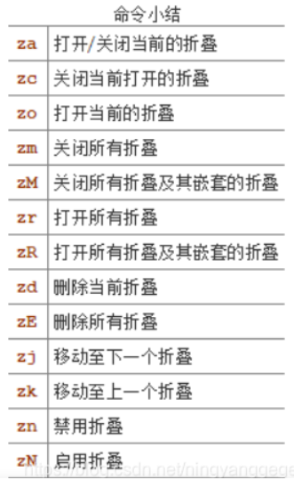
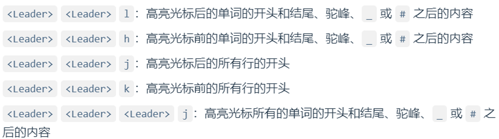

# VSCodeVim速查

[VSCodeVim中文文档](https://www.cnblogs.com/cloudhan/p/17036297.html)

[VSCode英文文档](https://github.com/VSCodeVim/Vim/blob/master/README.md)

## 我的VSCodeVim设置

==**本配置在插入模式下映射`j`和`k`键为`<Esc>` <br>Visual模式下映射`\`和`q`键为`<Esc>`<br>空格键为`<Leader>`**==

~~~json
"editor.lineNumbers": "relative", //设置行号相对显示
    "vim.easymotion": true, //easymotion插件
    "vim.incsearch": true,
    "vim.useSystemClipboard": true, //使用系统剪切板
    "vim.useCtrlKeys": true, 
    "vim.searchHighlightColor": "#5f00af", 
    "vim.hlsearch": true, //搜索高亮
    "vim.ignorecase": true, //搜索忽略大小写
    "vim.sneak": false,  //sneak插件关闭
    "vim.camelCaseMotion.enable": true, //开启驼峰模式
    "vim.highlightedyank.color": "rgba(250, 240, 170, 0.5)",  //复制高亮颜色
    "vim.highlightedyank.duration": 2000,  //复制高亮持续时间(ms)
    "vim.highlightedyank.enable": true,  //复制时高亮
    "vim.insertModeKeyBindings": [  
        {
            "before": [
                "j",
                "k"
            ],
            "after": [
                "<Esc>"
            ]
        }
    ],
    "vim.normalModeKeyBindingsNonRecursive": [
        {
            "before": [
                "U",
            ],
            "after": [
                "<C-r>"
            ]
        },
        {
            "before": [
                "<leader>",
                "n",
                "h"
            ],
            "commands": [
                ":nohl"
            ]
        },
        {
            "before": [
                "E"
            ],
            "after": [
                "g",
                "T"
            ]
        },
        {
            "before": [
                "R"
            ],
            "after": [
                "g",
                "t"
            ]
        },
        {
            "before": [
                "K"
            ],
            "commands": [
                "editor.action.insertLineAfter"
            ],
            "silent": true
        },
        {
            "before": [
                "<leader>",
                "r",
                "e"
            ],
            "commands": [
                ":register"
            ],
            "silent": true
        },
        {
            "before": [
                "H"
            ],
            "after": [
                "^"
            ]
        },
        {
            "before": [
                "L"
            ],
            "after": [
                "$"
            ]
        },
        {
            "before": [
                "<leader>",
                "d"
            ],
            "after": [
                "\"",
                "_",
                "d"
            ]
        },
        {
            "before": [
                "x"
            ],
            "after": [
                "\"",
                "_",
                "x"
            ]
        },
        {
            "before": [
                "s"
            ],
            "after": [
                "\"",
                "_",
                "s"
            ]
        },
        {
            "before": [
                "c"
            ],
            "after": [
                "\"",
                "_",
                "c"
            ]
        },
        {
            "before": [
                "<leader>",
                "d",
                "d"
            ],
            "after": [
                "\"",
                "_",
                "d",
                "d"
            ]
        },
        {
            "before": [
                "<leader>",
                "c",
                "c"
            ],
            "after": [
                "\"",
                "_",
                "c",
                "c"
            ]
        },
    ],
    "vim.visualModeKeyBindingsNonRecursive": [
        {
            "before": [
                "L"
            ],
            "after": [
                "$"
            ]
        },
        {
            "before": [
                "H"
            ],
            "after": [
                "^"
            ]
        },
        {
            "before": [
                "j",
                "k"
            ],
            "after": [
                "<Esc>"
            ]
        },
        {
            "before": [
                "p"
            ],
            "after": [
                "\"",
                "_",
                "d",
                "P"
            ]
        },
        {
            "before": [
                "x"
            ],
            "after": [
                "\"",
                "_",
                "x"
            ]
        }
    ],
    "vim.argumentObjectOpeningDelimiters": [
        "(",
        "[",
        "{"
    ],
    "vim.argumentObjectClosingDelimiters": [
        ")",
        "]",
        "}"
    ],
    "vim.leader": "<space>",
    "vim.handleKeys": {
        "<C-a>": false,
        "<C-f>": false,
        "<C-n>": false,
        "<C-w>": false
    },
~~~


## 移动光标


### 基本移动


> ```
> h    左
> j    下
> k    上
> l    右
> ```


### 以单词为单位的移动


- `w`：光标跳到下一个单词的开头

- `b`：光标跳到当前所在光标的单词开头，如果光标已在该单词的开头，则跳到下一个单词的开头
- `e`：光标跳到当前所在光标的单词结尾，如果光标已在该单词的结尾，则跳到下一个单词的结尾
- `g e`：光标跳到上一个单词的结尾


### 行内移动


- `0`        跳到本行第一个字符
-  `^`        跳到本行第一个非空字符
- `g_`      跳到本行最后一个非空字符
- `$`        跳到本行最后一个字符


### 行内搜索


- `f`   在当前行向后搜索第一个匹配
- `F`   在当前行向前搜索第一个匹配
- `t`   在当前行向后搜索第一个匹配，并停在匹配前
- `T`   在当前行向前搜索第一个匹配，并停在匹配前
- `;`   在当前行重复最近一次搜索
- `,`   在当前行向相反方向重复最近一次搜索


### 快速导航


- `(`   跳到前一个句子
- `)`   跳到下一个句子
- `{`   跳转到上一个段落
- `}`   跳转到下一个段落
- `%`   匹配当前括号
- `gg`  到文件开头
- `G`    到文件结尾
- `<C-d>`  向下滚动半屏
- `<C-u>`  向上滚动半屏
- `zz`：将当前行置于屏幕中央
- `zt`:  将当前行置于屏幕顶部, t 即 top
- `zb`:  将当前行置于屏幕底部, b 即 bottom
- `number + gg/G`:  将光标移动到指定行


### 标记定位


- `'` ：跳转到标记的⾏
- ` ：跳转到标记的位置(⾏和列)


- `m` + [小写字母]：只可在单个文件内跳转的标记；后面的为标记的标识符，用于跳转的指向；可以理解为当前标记的名字；下同
- `m` + [大写字母]：可在多个文件之间跳转的标记

比如我们在某个位置执行 `mm`，然后在本文件中的其他位置只要使用 `'m` 就可以跳到标记的行，使用 ``m` 就可以跳到标记的行和列；当然我们也可以用其他字母如 `mf`，当相应的跳转命令也变成 `'f` 和  <code>`f</code>


## 操作符(Operator)


- `d`：删除(delete)
- `dd`：删除当前行
- `D`   从光标删到行结尾
- `c`：修改(change)
- `y`：复制(yank)
- `yy`：复制当前行
- `v`：选中并进入可视模式(visual)
- `u`：撤销(undo)
- `U`：重做(redo)[^自定义的设置]  
- `p`：粘贴(paste)到光标后
- `P`：粘贴(paste)到光标前
- `x`：删除当前光标的字符


## 插入模式


- `i`    从光标之前的位置开始输入文本
- `a`    在光标之后的位置追加文本
- `I`    从当前行第一个非空字符之前的位置之前开始输入文本
- `A`    在当前行的末尾追加文本
- `o`    在光标位置下方新起一行并开始输入文本
- `O`    在光标位置的上方新起一行并开始输入文本
- `s`    删除当前光标位置的字符并开始输入文本
- `S`    删除当前行并开始输入文本

   

## 文本对象


文本对象的操作语法：**operater + 范围（内 / 外）+ 文本对象**

- 内部：`i` ，意指 inner
- 外部：`a` ，英文单词 a，一个的意思

---

vim 中的文本对象主要有这一些：

- `(` 或 `)` ：一对 `()`
- `b` ：一对 `()`
- `{` 或 `}` ：一对 `{}`
- `B` ：一对 `{}`
- `[` 或 `]` ：一对 `[]`
- `<` 或 `>` ：一对 `<>`
- `t` ：tag （HTML 或 XML）标签
- `'` 或 `'` ：一对 `''`
- `"` 或 `"` ：一对 `""`
- \``` 或 ``` ：一对 ````
- `w` ：一个单词
- `s` ：一个句子；以 `.` `!` `?` 结尾即为一个句子
- `p` ：一个段落；以一个换行符间隔即为一个段落

> 插件扩展的

- [`i`](#vim-indent-object)一个缩进等级
- [`e`](#vim-textobj-entire)整个文件
- [`a`](#vim-textobj-arguments)一个参数


## 搜索与替换


- 从光标位置向下查找：`/` + string + enter
- 从光标位置向上查找：`?` + string+ enter
- 查看搜索历史：`/` + 上下方向键


在大多数情况下，其实我们更需要的是精确搜索，这时我们可以把光标移到我们需要搜索的单词上，然后按下以下命令：

- 向上查找：`#`
- 向下查找：`*`

这样就可以愉快地搜索了；我们还可以使用：

- `n`：跳到下一个结果
- `N`：跳到上一个结果


光标在查找结果上使用`cw`修改查找结果,按`n`到下一个匹配可使用`.`重复上次修改

替换推荐使用VSCode的快捷键   在[上面](#我的VSCodeVim设置)的设置的最后我已将<C-f>和<C-b>交由VSCode处理


## 大小写转换


- `~`：将光标下的字母改变大小写
- `3~`：将光标开始的3个字母改变其大小写
- `g~~`：改变当前行字母的大小写
- `gUU`：将当前行的字母改成大写
- `guu`：将当前行的字母改成小写
- `gUaw(gUiw)`：将光标下的单词改成大写
- `guaw(guiw)`：将光标下的单词改成小写

## 折叠




## 宏命令

宏（macro）即可以把一系列的操作录制成组并暂存起来，然后通过特定的指令重复去触发执行。


- `q` + [字母]：开始录制，并把当前一次的录制命名为 [字母]；如 `qa`，则当前录制的宏操作名称为 `a`，如 `qq`，宏操作则为 `q`；录制完后，再输入 `q` 则退出录制
- `:req` + [字母]：查看录制好的名为 [字母] 的宏操作
- `@` + [字母]：调用名为 [字母] 的宏操作
- `@@`：调用最后一次执行的宏操作
- [数字] + `@` + [字母]：以 [数字] 次数重复执行名称为 [字母] 的宏操作
- `q` + [大写字母]：在对应名为 [字母] 的宏操作后追加命令；比如我们录制一个宏操作为 a，他的功能是删除每行的第一个单词；则我们首先录制改宏操作：`qa^diw`；录制完后发现我们删除了第一个单词后，还需要把光标移到下一行，这时我们可以键入 `qAj`，即在宏操作 a 后面追加个 `j` 命令，就可以愉快地继续使用宏操作 a 了


## 有用的的插件


### [vim-easymotion](https://github.com/VSCodeVim/Vim?tab=readme-ov-file#vim-easymotion)


| Setting        | Description                      | Type    | Default Value |
| -------------- | -------------------------------- | ------- | ------------- |
| vim.easymotion | Enable/disable easymotion plugin | Boolean | false         |


| Motion Command              | Description              |
| --------------------------- | ------------------------ |
| `<leader><leader> s <char>` | Search character         |
| `<leader><leader> f <char>` | Find character forwards  |
| `<leader><leader> F <char>` | Find character backwards |
| `<leader><leader> t <char>` | Til character forwards   |
| `<leader><leader> T <char>` | Til character backwards  |
| `<leader><leader> w`        | Start of word forwards   |
| `<leader><leader> b`        | Start of word backwards  |
| `<leader><leader> e`        | End of word forwards  	 |
| `<leader><leader> ge`       | End of word backwards |



### [vim-surround](https://github.com/VSCodeVim/Vim?tab=readme-ov-file#vim-surround)


> 使用该选项开启

| Setting      | Description                 | Type    | Default Value |
| ------------ | --------------------------- | ------- | ------------- |
| vim.surround | Enable/disable vim-surround | Boolean | true          |


| Surround Command           | Description                                              |
| :------------------------- | -------------------------------------------------------- |
| `y s <motion> <desired>`   | Add `desired` surround around text defined by `<motion>` |
| `y s s <desired>`          | 选中当前行并使用<desired>包裹                            |
| `d s <existing>`           | Delete `existing` surround                               |
| `c s <existing> <desired>` | Change `existing` surround to `desired`                  |
| `S <desired>`              | Surround when in visual modes (surrounds full selection) |

Some examples:

- `"test"` with cursor inside quotes type `cs"'` to end up with `'test'`
- `"test"` with cursor inside quotes type `ds"` to end up with `test`
- `"test"` with cursor inside quotes type `cs"t` and enter `123>` to end up with `<123>test</123>`


我们有如下字符串，光标在它内部时 normal 模式下使用 `cs"'`

```
"Hello world!"
```


则会变成以下这样：

```
'Hello world!'
```


这时我们使用 `cs'<q>`，就变成了：

```
<p>Hello world!</p>
```


再使用 `cst"`，就回到最初的模样（疑惑为什么是 `t` 的人需要去复习一下[前面](https://vim.nauxscript.com/vim/day-6.html#文本对象)了）：

```
"Hello world!"
```


删除包裹的符号，我们使用 `ds"`：

```
Hello world!
```


如果我们把光标移到 `hello` 单词上，输入 `ysiw]`，则变成这样：

```
[Hello] world!
```


如果我们要把中括号变成花括号并且单词和符号之间要有空格，我们可以使用 `cs]{` （如果使用 `}` 则添加的花括号是没有空格的，`)` `]` 同理）：

```
{ Hello } world!
```

这时，我们还可以通过 `yssb` 或 `yss)` 来给整行添加包裹：


```
({ Hello } world!)
```

输入 `ds{ds)` 去掉所有包裹：


```
Hello world!
```

对于前端开发来说，他是一个很有用的插件；比如我们现在有一个这样的标签：


```
<p>hello world</p>
```

这时我们使用 `V` 进入 linewise visual model（行内可视化模式），再键入 `S<div class="important">`，就变成了：


```
<div class="important">
<p>hello world</p>
</div class="important">
```

在我们日常开发中，尤其是写 html 时，这非常好用。而且我们还可以使用 `.` 来重复执行 `ds` `cs` `yss` 这类的指令，一如我们之前提到那样。

---


```
hello
```

在 hello 中输入 `ysiwt` + `div`，则变成了：


```
<div>hello</div>
```

再输入 `ysst` + `div`，就成了：


```
<div><div>hello</div></div>
```


### [CamelCaseMotion](https://github.com/VSCodeVim/Vim?tab=readme-ov-file#camelcasemotion)


> 使用该选项开启

| Setting                    | Description                    | Type    | Default Value |
| -------------------------- | ------------------------------ | ------- | ------------- |
| vim.camelCaseMotion.enable | Enable/disable CamelCaseMotion | Boolean | false         |


| Motion Command         | Description                                                  |
| ---------------------- | ------------------------------------------------------------ |
| `<leader>w`            | Move forward to the start of the next camelCase or snake_case word segment |
| `<leader>e`            | Move forward to the next end of a camelCase or snake_case word segment |
| `<leader>b`            | Move back to the prior beginning of a camelCase or snake_case word segment |
| `<operator>i<leader>w` | Select/change/delete/etc. the current camelCase or snake_case word segment |


### [vim-indent-object](https://github.com/VSCodeVim/Vim?tab=readme-ov-file#vim-indent-object)

新增文本对象`i` 表示和光标所在行同缩进等级的代码块

| Command        | Description                                                  |
| -------------- | ------------------------------------------------------------ |
| `<operator>ii` | This indentation level                                       |
| `<operator>ai` | This indentation level and the line above (think `if` statements in Python) |
| `<operator>aI` | This indentation level, the line above, and the line after (think `if` statements in C/C++/Java/etc) |

**举例**

> yii


> yai


> ya工


### [vim-textobj-entire](https://github.com/VSCodeVim/Vim?tab=readme-ov-file#vim-textobj-entire)

新增文本对象`e` (entire) 表示当前文件

- `ae`：当前文本所有内容
- `ie`：当前文本所有内容，但不包括前面和后面的 blank 字符

有了该文本对象后,可以使用`yie`复制本文件所有内容, `vie`全选, `die`全部删除


### [vim-textobj-arguments](https://github.com/VSCodeVim/Vim?tab=readme-ov-file#vim-textobj-arguments)


| Motion Command | Description                        |
| -------------- | ---------------------------------- |
| `<operator>ia` | The argument excluding separators. |
| `<operator>aa` | The argument including separators. |

Usage examples:

- `cia` - change the argument under the cursor while preserving separators like comma `,`.
- `daa` - will delete the whole argument under the cursor and the separators if applicable.

| Setting                             | Description                  | Type        | Default Value |
| ----------------------------------- | ---------------------------- | ----------- | ------------- |
| vim.argumentObjectOpeningDelimiters | A list of opening delimiters | String list | ["(", "["]    |
| vim.argumentObjectClosingDelimiters | A list of closing delimiters | String list | [")", "]"]    |
| vim.argumentObjectSeparators        | A list of object separators  | String list | [","]         |


~~~
// Examples:
// 删除一个参数
function(arg1,    ch)  // 在第二个参数（即 “    ch”）中输入 daa
function(arg1|) // 就会变成这样，| 代表这时光标所在位置；如果这时再输入 daa
function(|) // 就会变成这样

// 修改一个参数
function(arg1,    ch) // 在第二个参数（即 “    ch”）中输入 cia
function(arg1,    |) // 就会变成这样，| 代表这时光标所在位置
~~~


### [vim-commentary](https://github.com/VSCodeVim/Vim?tab=readme-ov-file#vim-commentary)


Similar to [vim-commentary](https://github.com/tpope/vim-commentary), but uses the VS Code native *Toggle Line Comment* and *Toggle Block Comment* features.

Usage examples:

- `gc` - toggles line comment. For example `gcc` to toggle line comment for current line and `gc2j` to toggle line comments for the current line and the next two lines.
- `gC` - toggles block comment. For example `gCi)` to comment out everything within parentheses.
